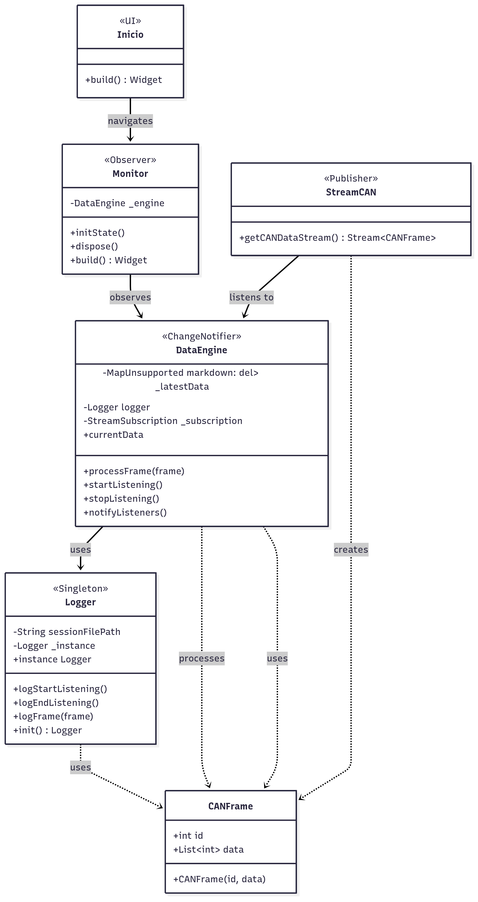

# Desafio-Eolian-Flutter
Desafío Técnico Eolian Auto Solar  - Sistema de Adquisición de Datos (Flutter)

## Contexto del Problema
En el auto solar, el bus de comunicación CAN es el sistema nervioso que conecta todos los componentes electrónicos. El computador central necesita un software robusto y eficiente para leer los mensajes de este bus (ej. voltaje de la batería, velocidad de las ruedas), mostrarlos en tiempo real para diagnóstico y guardarlos para un análisis post-carrera.
 
Tu misión es diseñar la arquitectura de este sistema y crear un prototipo funcional de una de sus partes clave.

## Avance Semanal

### Semana 1:
**Fecha**: 01/07/2025

#### 1. Actividades Realizadas:
Leí el enunciado y diseñé un diagrama de arquitectura básico, definiendo que patrones de diseño se utilizarán. Recordé la sintaxis de dart. Creé proyecto base en flutter, carpetas importantes para el proyecto y se subió a GitHub. Implementé la interfaz de usuario para visualizar los datos actuales y el módulo Logger.

##### Arquitectura: 
Se ha diseñado a priori para que el sistema funcione así:


De manera que, el módulo CANReader utilizaría un Stream como Publisher, teniendo de Suscribers tanto a DataEngine como el Logger. Ambos módulos contendrían la lógica para decodificar los datos en tiempo real y para guardar un historial de todos los datos recibidos, respectivamente. Por su parte, el DataEngine tendría un ChangeNotifier (funcionalidad de dart) que serviría de Observer para conectar con la UI.

```
[ CANReader ] --(Stream: Publisher)--> [ DataEngine ]
[ CANReader ] --(Stream: Publisher)--> [ Logger ]

[ DataEngine ] --(ChangeNotifier: Observer)--> [ UI ]
```
Se ha pensado en poder hacer que se vea el logger tipo consola en la UI también, pero por el momento simplemente se espera que se guarde el historial en un doc. nuevo cada vez que se inicie una recepción de datos.

#### 2. Descubrimientos y Aprendizajes Clave:
Descubrí la libreria de dart (dart:io) que permite crear y escrbir documentos/archivos locales, esto se aplicará para el guardado del historial del log. También volví a reaprender y  familiarizarme con la sintaxis de de dart.

#### 3. Bloqueos o Dificultades Encontradas:
El manejo del tiempo ha imposibilitado un avance más veloz en el proyecto. Me ha costado entender como se quiere el log. 

#### 4. Plan para la Próxima Semana:
Implementar la funcionalidad central del sistema, es decir:
- Simulación de la red CAN y lógica de decodificación
- Conectar el ChangeNotifier para mostrar datos actualizados en la UI en tiempo real.
Formalizar formato de la Arquitectura.

### Semana 2:
**Fecha**: 09/07/2025

#### 1. Actividades Realizadas:

Se implementó la simulación de Stream de una red CAN, además de los módulos encargados de escucharlo (data_engine). Se implementó la comunicación del Data Engine, un ChangeNotifier, tanto con la UI como con el Logger. Se cambió la UI, haciéndola más simple pero mostrando las variables que se decidieron enviar a través de la red CAN. Se implementó las funcionalidades del Logger, permitiendo que cree un archivo .log con los logs requeridos y que imprima en la consola.

##### Arquitectura: 
La arquitectura del sistema cambió a: 



Estos cambios se hicieron para mantener un flujo más controlado, de manera que si la UI (el monitor) tiene que interactuar con el Logger, o viceversa, siempre sea a través del Data Engine. De esta manera, los patrones de diseño del sistema son:

- **Publisher/Subscriber**: Stream CAN → Data Engine
- **Observer**: Data Engine (ChangeNotifier) → UI (Monitor)  
- **Singleton**: Logger para una instancia única por sesión


#### 2. Descubrimientos y Aprendizajes Clave:
Se descubrió la función para generar números de forma random en Dart. También se aprendió la diferencia entre un stream de tipo broadcast y uno que al desuscribirse también deja de enviar señales hasta que se le instancie de nuevo. Específicamente, los streams creados con funciones `async*` (como el que se usó) se detienen automáticamente cuando el último listener se desuscribe, evitando el consumo innecesario de recursos. Por el contrario, los streams broadcast pueden mantener múltiples listeners y requieren un manejo manual de su ciclo de vida. 

#### 3. Bloqueos o Dificultades Encontradas:
El mayor bloqueo fue la falta de tiempo para avanzar con mayor velocidad. Hubieron dudas pero fueron todas resueltas, así que se pudo cumplir con lo esperado esta semana. Se gastó algo de tiempo teniendo que cambiar las interacciones entre el logger y la UI, pero no por problemas técnicos o funcionales, más que nada para que la arquitectura quedara más limpia.


#### 4. Plan para la Próxima Semana:
Recibir feedback y nuevas tareas.

